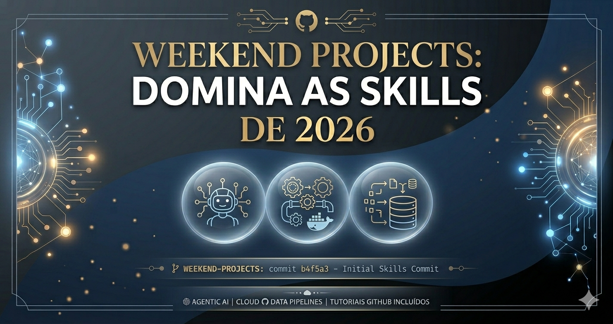

[🇵🇹 PT](#) | [🇬🇧 EN](#)

# 🧠 Projetos de Fim de Semana (The Weekend Project).
###  O Teu Treino de Elite.

Bem-vindo ao repositório de **Projetos de Fim de Semana**. Este espaço foi desenhado para profissionais e entusiastas que compreenderam uma verdade fundamental do mundo tecnológico: **a melhor forma de aprender é criar**.

Muitas vezes olhamos para profissionais brilhantes e assumimos que o seu sucesso se deve estritamente ao talento natural. A realidade é muito mais inspiradora. As pessoas verdadeiramente brilhantes são-no porque, longe dos holofotes e nas horas em que o mundo descansa, treinaram novas competências de forma consistente. O domínio técnico constrói-se no silêncio dos fins de semana, linha de código a linha de código.

Tudo na vida — e em especial a engenharia de software e a inteligência artificial — requer **consistência e determinação**. O caminho do desenvolvimento está repleto de erros de sintaxe, bugs inesperados e problemas de configuração. O segredo do sucesso não é a ausência de obstáculos, mas sim a decisão firme de **não desistir ao primeiro percalço**. Cada erro solucionado é um degrau acima no teu nível profissional.

---

## 🗓️ Calendário de Treino

### 🚀 [Fim de Semana 1: Competências Mais Procuradas de 2026](projects.md)
No nosso primeiro fim de semana, focamos o nosso esforço em três pilares que estão a moldar o mercado global:
1. **Agentic AI:** Criação de agentes de inteligência artificial autónomos.
2. **DevOps & Cloud:** Pipelines automáticos de CI/CD para colocar código em produção sem fricção.
3. **Engenharia de Dados:** Pipelines modernos de ETL para transformação e valorização de dados brutos.

Acede ao ficheiro completo de projetos do **Fim de Semana 1** aqui:  
👉 **[Ver Projetos e Tutoriais do Fim de Semana 1](projects.md)**

---

*“A mestria não é um acidente, é o resultado de uma prática intencional.”* .
 Bons commits e excelente fim de semana de código! ***
